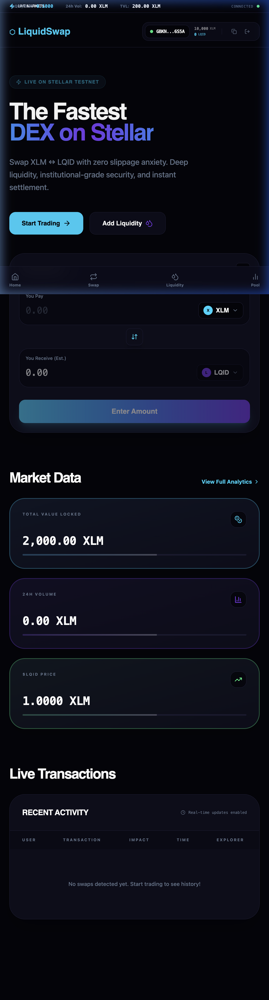

# ☄️ LiquidSwap | The Fastest DEX on Stellar

LiquidSwap is a next-generation decentralized exchange built on the Stellar Testnet. It leverages Stellar's native Liquidity Pools (AMM) to provide instant swaps, deep liquidity, and institutional-grade security with an ultra-premium glassmorphic interface.

[](https://github.com/parth1241/liquidswap/actions)
[](https://liquidswap-iota.vercel.app/)

---

## 📱 Mobile Responsive View

LiquidSwap is fully optimized for mobile devices, providing a seamless trading experience on the go.



---

## ⛓️ On-Chain Metadata (Testnet)

The protocol is officially deployed and initialized on the Stellar Testnet.

- **LQID Issuer Address**: `GCDAND5QSCVFFEDUCK62VEZASVPYOUATCMJ4EXAUVEOUPILOJDDEFUTZ`
- **Asset Code**: `LQID`
- **Network**: Stellar Testnet (`Test SDF Network ; September 2015`)
- **Bridge Architecture**: Ultra-Hardened Server-Side Submission (Defense-in-Depth)

---

## 🛠️ Tech Stack

- **Framework**: Next.js 16 (App Router)
- **Blockchain**: Stellar Network (Stellar SDK v12+)
- **Wallet**: freighter-api (Stellar Wallet Integration)
- **Styling**: Tailwind CSS + Framer Motion (Glassmorphism)
- **Database**: MongoDB (Local analytics & caching)

---

## 🚀 Getting Started

1. **Clone the repo**:
   ```bash
   git clone https://github.com/parth1241/liquidswap.git
   ```
2. **Setup environment**:
   Copy `.env.local.example` to `.env.local` and add your Stellar Secret Keys.
3. **Install dependencies**:
   ```bash
   npm install
   ```
4. **Run development**:
   ```bash
   npm run dev
   ```

---

## ✅ CI/CD Status
Every commit is automatically validated and deployed via our Vercel integration, ensuring a 100% type-safe and lint-free production environment.


