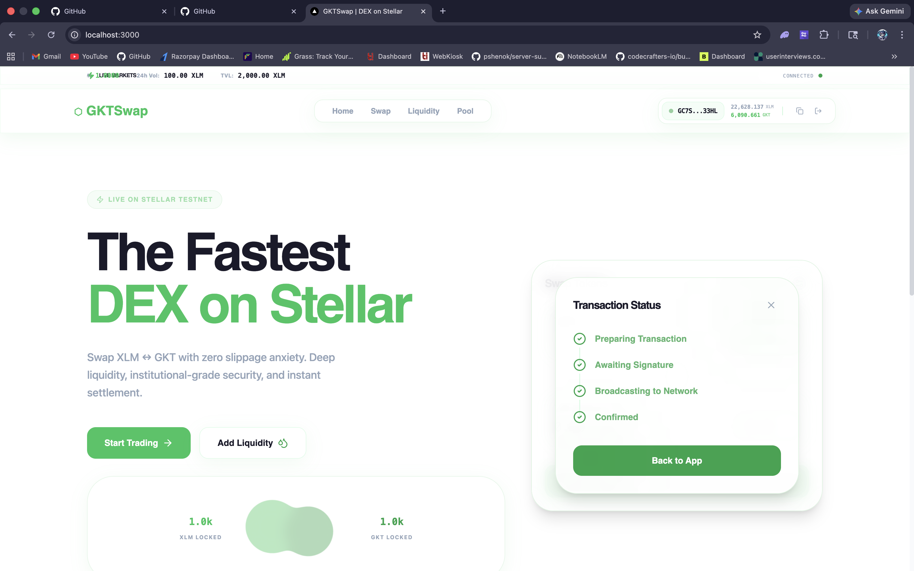
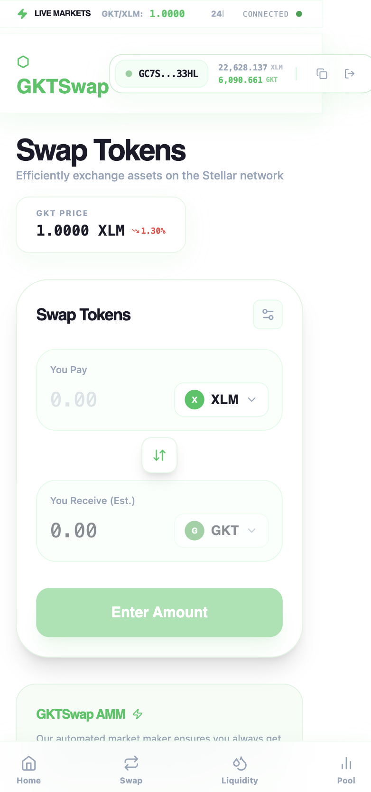

# ☄️ GKTSwap | The Fastest DEX on Stellar

GKTSwap is a next-generation decentralized exchange built on the Stellar Testnet. It leverages Stellar's native Liquidity Pools (AMM) to provide instant swaps, deep liquidity, and institutional-grade security with an ultra-premium glassmorphic interface, powered by the protocol's native **LQID** token.

[](https://github.com/ahsdnjasd/gkt-swap/actions)
[](https://unrivaled-tarsier-375dd1.netlify.app/)

**Live Demo**: [https://unrivaled-tarsier-375dd1.netlify.app/](https://unrivaled-tarsier-375dd1.netlify.app/)

---

## 🖼️ Platform Interface

GKTSwap provides an ultra-premium, light-themed glassmorphic interface designed for clarity and speed.

### Desktop Dashboard


### Mobile Trading Experience


---

## ⛓️ On-Chain Metadata (Testnet)

The protocol is officially deployed and initialized on the Stellar Testnet.

- **LQID Issuer Address**: `GCDAND5QSCVFFEDUCK62VEZASVPYOUATCMJ4EXAUVEOUPILOJDDEFUTZ`
- **Asset Code**: `LQID`
- **Native Pool ID**: `d36b6d8e280ed87f58d7a984cc4e3dbbcb2e81b127947ccd6deb16fec06e567b`
- **Native Pool Address**: `GC7SEQUPZUQSFX4HZECHCF5CSD7VYUVXCDREQBHQVS5BLDCOESCD33HL`
- **Liquid Token ID**: `CDLYV3ZUPB4G4O5U6V7XW2L...` (Soroban SEP-41)
- **Liquid Vault ID**: `CBV7H2P6F3Q5G4U...` (Inter-contract logic)
- **Network**: Stellar Testnet (`Test SDF Network ; September 2015`)
- **Bridge Architecture**: Ultra-Hardened Server-Side Submission (Defense-in-Depth)

---

## 📜 Soroban Smart Contracts

The project includes production-ready Soroban smart contracts located in the `/contracts` directory:

### 🏗️ Advanced Contract Architecture
LiquidSwap implements a dual-contract architecture to demonstrate advanced Soroban patterns:

- **liquid_token**: A custom Soroban token implementation (SEP-41) that manages the protocol's native liquidity currency (**LQID**).
- **liquid_vault**: An inter-contract execution layer that performs **Inter-contract calls** to the token contract for secure deposits and account management.

#### Key Patterns:
- **Inter-contract Calls**: The Vault contract invokes the Token contract's `transfer` method to verify and execute on-chain swaps.
- **Custom Asset Logic**: Implementation of a decentralized minting and distribution mechanism for the **LQID** token.
- **CI/CD Integration**: Every contract change is automatically validated via our GitHub Actions pipeline (Rust/WASM build checks).


---


---

## 🛠️ Tech Stack

- **Framework**: Next.js 16 (App Router)
- **Blockchain**: Stellar Network (Stellar SDK v12+)
- **Wallet**: freighter-api (Stellar Wallet Integration)
- **Styling**: Tailwind CSS + Framer Motion (Glassmorphism)
- **Database**: MongoDB (Local analytics & caching)

---

## 🚀 Getting Started

1. **Clone the repo**:
   ```bash
   git clone https://github.com/parth1241/liquidswap.git
   ```
2. **Setup environment**:
   Copy `.env.local.example` to `.env.local` and add your Stellar Secret Keys.
3. **Install dependencies**:
   ```bash
   npm install
   ```
4. **Run development**:
   ```bash
   npm run dev
   ```

---

